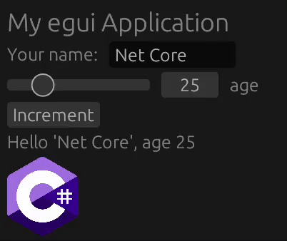
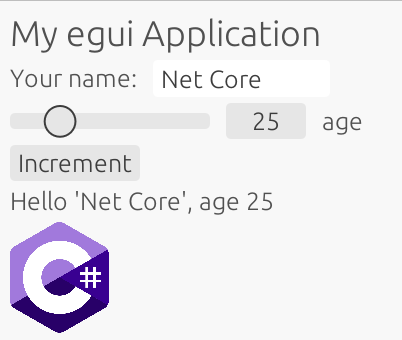

# 🖌 Egui.NET: unofficial C# bindings for the easy-to-use `egui` library

[](https://github.com/DouglasDwyer/Egui.NET)
[](https://www.nuget.org/packages/Egui.NET/)
[](https://douglasdwyer.github.io/Egui.NET)
[](https://github.com/emilk/egui/blob/main/LICENSE-MIT)
[](https://github.com/emilk/egui/blob/main/LICENSE-APACHE)

This project contains C# bindings for [egui](https://github.com/emilk/egui). egui (pronounced "e-gooey") is a simple, fast, and highly portable immediate mode GUI library written in Rust.

Egui.NET aims to provide safe, idiomatic C# bindings that mirror the Rust API as closely as possible. 

Egui.NET can be used anywhere you can draw textured triangles, which means you can easily integrate it into your game engine of choice.

For further information, please see [the primary `egui` README](https://github.com/emilk/egui/blob/main/README.md).

## Example

```csharp
ui.Heading("My egui Application");
ui.Horizontal(ui =>
{
    ui.Label("Your name:");
    ui.TextEditSingleline(ref name);
});
ui.Add(new Slider<int>(ref age, 0, 120).Text("age"));
if (ui.Button("Increment").Clicked)
{
    age += 1;
}
ui.Label($"Hello '{name}', age {age}");
ui.Image(EguiHelpers.IncludeImageResource("csharp.png"));
```

 &nbsp; &nbsp; 

## Integrations

The [`SilkOpenGl`](/examples/SilkOpenGl/) example demonstrates how to incorporate Egui.NET with an OpenGL application that uses [`Silk.NET`](https://github.com/dotnet/Silk.NET) for windowing. No off-the-shelf integrations for C# exist at this time, but [adding a new egui integration is easy](https://docs.rs/egui/latest/egui/#integrating-with-egui).

## Incomplete features

Egui.NET aims to expose the entirety of `egui`'s functionality. Although 97% of bindings are complete, there are currently a few things missing:

- Functions requiring `'static` callbacks such as [`StyleModifier`](https://docs.rs/egui/latest/egui/style/struct.StyleModifier.html) or [`Grid::with_row_color`](https://docs.rs/egui/latest/egui/struct.Grid.html#method.with_row_color). These functions are difficult to bind because Rust-side code must own a C# closure
- Custom [`BytesLoader`](https://docs.rs/egui/latest/egui/load/trait.BytesLoader.html)s, [`ImageLoader`](https://docs.rs/egui/latest/egui/load/trait.ImageLoader.html)s, and [`TextureLoader`](https://docs.rs/egui/latest/egui/load/trait.TextureLoader.html)s
- Persistence (the ability to save a `Context` to disk and load it later)
- Accessibility and screen reader support with [`accesskit`](https://github.com/AccessKit/accesskit)

## Project structure

Egui.NET is designed so that:

- The bindings are completely safe; they cannot cause undefined behavior
- The bindings closely mirror the Rust API, while taking advantage of C# features like properties
- The bindings are easy to update for new `egui` releases

To this end, Egui.NET uses an *autobinder* to generate approximately 75% of the packaged code. The remaining bindings are written by hand, to deal with corner cases and make the library cleaner. Using a `json` file produced by `rustdoc`, the autobinder generates a list of **all** functions exposed by `ecolor`/`egui`/`emath`/`epaint`. The autobinder generates Rust-side and C#-side code for as many of these functions as possible. In addition, the autobinder uses [`serde-generate`](https://github.com/novifinancial/serde-reflection/tree/main/serde-generate) to emit C# type definitions for serializable `egui` types. Because the `egui` API is largely functional (with many plain-old-data types) this covers a large swath of the library.

To ensure safe communication between C# and Rust, FFI is performed using [bincode](https://github.com/bincode-org/bincode) serialization. When C# makes an `egui` function call at runtime, the arguments and return value are serialized across the language boundary.

The project is organized in the following way:

- docs -  contains files for customizing the DocFX output
- Egui - contains the C# project definition and manually-written C# bindings
- egui_net - contains the runtime `egui` crate that is compiled to a `dylib` and loaded by C#.
  - progress_report.txt - describes what percentage of the API is complete, and identifies functions that have yet to be bound. Generated every time `cargo test` is run
- egui_net_bindgen - helper crate that contains the autobinder. Leverages `rustdoc` and `serde-generate` to bind most of egui automatically. The bindings are written to `target/bindings` whenever `cargo build` is run
- examples - example programs demonstrating how to use the library in C#
- media - images and other media used in documentation
- serde-generate - a fork of the `serde-generate` crate, with some customizations for the Egui.NET API

The project also compiles [a fork of `egui`](https://github.com/DouglasDwyer/egui/tree/egui_net_patches). The main purpose of the fork is to mark additional `egui` types as serializable, so that they may be shared with C# easily.

### Supported platforms

- `aarch64-pc-windows-msvc`
- `x86_64-pc-windows-msvc`
- `aarch64-apple-darwin`
- `x86_64-apple-darwin`

### Building from source

To build from source, the following dependencies are required:

- [`.NET 9.0 SDK`](https://dotnet.microsoft.com/en-us/download/dotnet/9.0)
- [`Rust`](https://www.rust-lang.org/tools/install)
- [`cross-rs`](https://github.com/cross-rs/cross) (for cross-compiling the Nuget package)
- [`Docker`](https://www.docker.com/products/docker-desktop/) (for cross-compiling the Nuget package)

Once installed, the following commands should be available:

- `cargo build` - generate the Rust library for the current platform
- `cargo test` - build and update the `progress_report.txt`
- `dotnet build Egui` - build the Egui.NET library for the current platform
- `dotnet build Egui -c Release` - build the Egui.NET library in release mode for all platforms
- `dotnet pack` - generate a Nuget package for all platforms